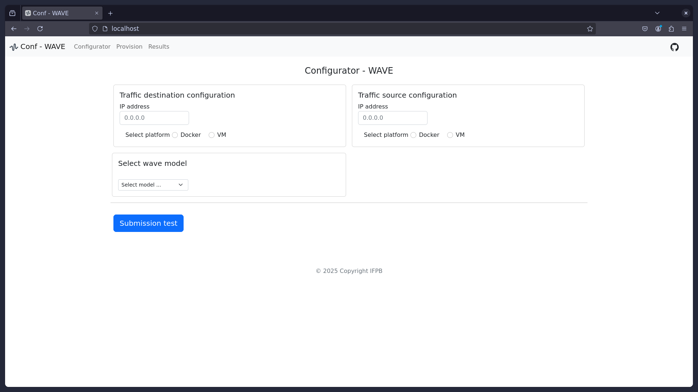

# WAVE - Multiple load generator for computer network experimentation

[WAVE User Manual](WAVE_User_Manual.pdf)

[Salão de Ferramentas SBRC 2023 (previous work)](https://doi.org/10.5753/sbrc_estendido.2023.712)

Experimentation is a crucial step in many types of scientific research, enabling researchers to evaluate the validity of their hypotheses. In computer networks, one of the key challenges during the experimentation phase is finding load generators capable of accurately modeling diverse traffic patterns for various applications. To address this issue, our previous work introduced a load generator designed to generate load based on real application behavior. In this sense, this work improves the WAVE - Workload Assay for Verified Experiments. A new WAVE version can generate loads for three distinct patterns: sinusoid, flashcrowd, and step. Additionally, it now supports microbursts and container-based environments.

This repository is organized into three main sections: requirements, download and initialization, and finalization of the new WAVE tool.

## Checking the Required Requirements

### Checking if Python3 is installed and it's version:


### Additionally, the VirtualEnv virtual environment is required:


### Checking the Docker and docker compose components:


### Checking what version of Virtualbox is installed:


### Checking what version of Vagrant is installed:


The versions shown in the figures were those tested at the time of this manual's creation.

## Downloading the Code and Starting the Environment

### Cloning the official repository and starting the system:

```
$ git clone https://github.com/ifpb/new_wave.git
$ cd new_wave/wave
$ ./app-compose.sh --start
```

### Checking the execution in a Docker enviroment:


As can be seen in the figure above, the WAVE Initialization module uses two containers for its execution: wave-app and grafana-oss. On the left side of the figure, we have the output of the WAVE startup command.

### The WAVE Web module can be accessed via a browser



The form contains fields for entering network data for both the traffic load source and destination. In addition to the IP address, it is possible to select environment provisioning through a container or a virtual machine with configurable memory size and number of virtual CPUs. Finally, the user can choose which workload model to apply, either sinusoid, flashcrowd or step and if they want to use micro-burst as well.

## Ending the WAVE Execution

### Finalizing and removing the container environment:

```
$ ./app-compose.sh --destroy
```

By running the command above, the user terminates the WAVE WEB module and removes the containers responsible for the other initiated modules. To restart the entire system, simply execute the same command, replacing the --destroy argument with --start.
